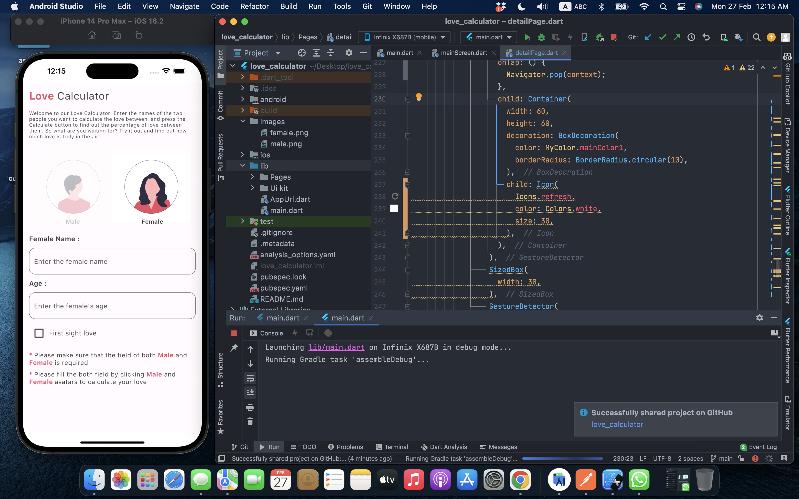

# love_calculator

A Calculator that can calculate love using some factors. For the backend I have used Rapid API to get result.

## Getting Started

[(https://www.youtube.com/embed/GxCHEa1r6k4)

## Click the Image to check more about the project.

A few resources to get you started if this is your first Flutter project:

- [Lab: Write your first Flutter app](https://docs.flutter.dev/get-started/codelab)
- [Cookbook: Useful Flutter samples](https://docs.flutter.dev/cookbook)

For help getting started with Flutter development, view the
[online documentation](https://docs.flutter.dev/), which offers tutorials,
samples, guidance on mobile development, and a full API reference.
